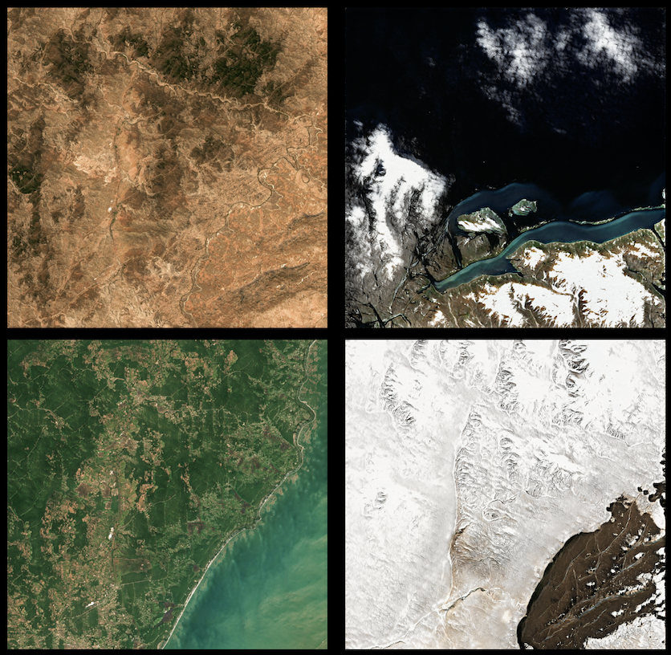
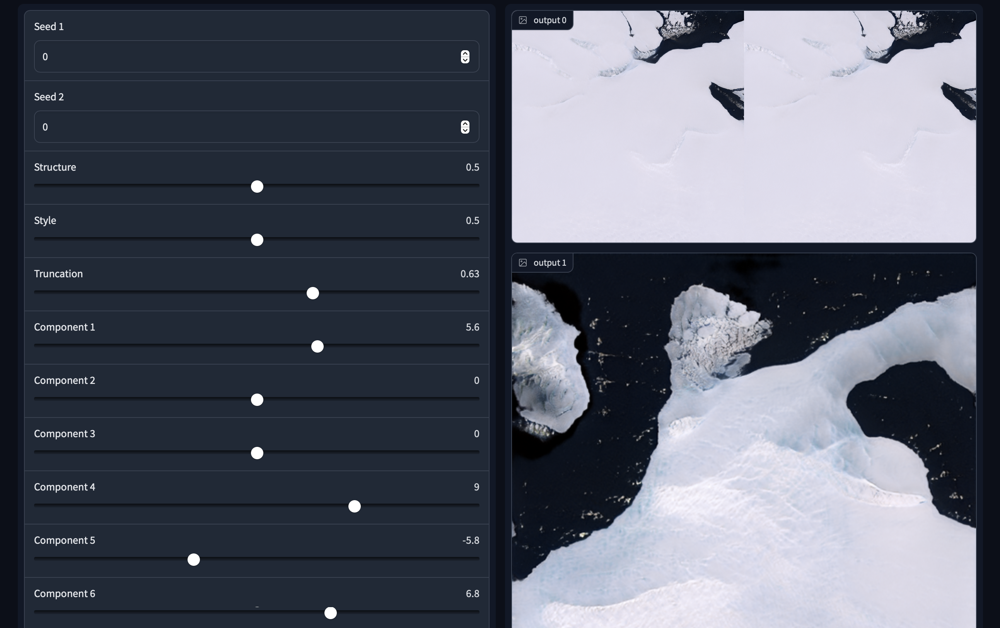

# GANAesthetic : Landshapes-editor

The base code use from GANSPACE + Gradio Framework

Climate change has become gradually more prevalent and dangerous, however,
there has been still a lack of active public engagement. This can be explained by the fact the media portraits climate change as an abstract issue.
Therefore, it is more effective to convey the message through visual art, where it is more possible can evoke the emotional response in the individuals.
Incorporating human perceptual factor results in improved image outputs from the generative adversarial neural network (GAN).The GANAesthetic provides an
interface with UI component known as sliders, where users can interactively explore aesthetically pleasing satellite images with StyleGAN2.

